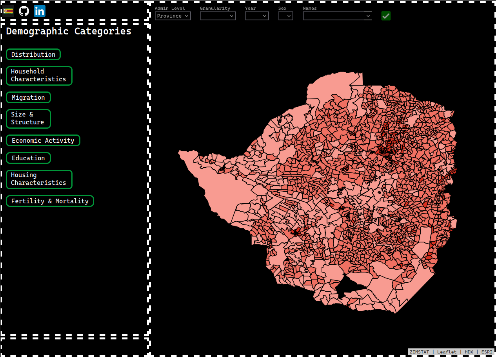

<h2>About Vagari veZimbabwe</h2>
Visualising population data at different units of aggregation.

<h2>Current Status</h2>

<h2>Ongoing Work</h2>
<ol>
	<li>Restructuring the front-end (views) directory.</li>
	<li>Introducing Bulma for styling.</li>
	<li>Tests.</li>
	<li>Refactoring request-response workflows.</li>
	<li>Enhancing map functionalities by for example adding popups, zooming, and polygon labels.</li>
	<li>Experimenting with different spatial data representations (WKT, GeoJSON) in the database to optimise performance.</li>
	<li>Testing potential performance improvements from streaming API responses.</li>
</ol>

<h2>Future</h2>
<ul>
	<li>Deployment.</li>
	<li>Migrating to TypeScript.</li>
	<li>Replacing Leaflet with MapLibre or ArcGIS API for JavaScript.</li>
	<li>Adding more data to support non-spatial visualisations.</li>
</ul>
